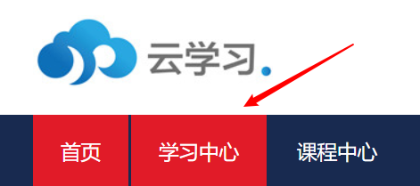

# 云学堂刷课脚本

本脚本基于 [GreasyFork 云学堂刷课脚本](https://greasyfork.org/zh-CN/scripts/403295-%E4%BA%91%E5%AD%A6%E5%A0%82%E8%87%AA%E5%8A%A8%E5%88%B7%E8%A7%86%E9%A2%91-yunxuetang-cn) 修改而成。

修改内容如下：

* 删除了采集试卷答案，侵犯隐私的功能
* 修复了
  * 视频完成后不能返回上一页的 bug
* 加入了对以下页面的支持
  * `http://*.yunxuetang.cn/kng/view/document/*` 
  * `http://*.yunxuetang.cn/kng/view/video/*`
  * `http://*.yunxuetang.cn/kng/view/package/*`
  * `http://*.yunxuetang.cn/mit/myhomeworkexprience* `

## Introduction

**主要功能**：他

* 保证视频打开后自动化播放完毕：自动化点击自动学习，手动暂定后继续播放
* 检测当前没播放完的视频，进入该视频播放完并返回

**如何使用**：

进入云学习首页，点击学习中心，脚本会自动监测学习中心的学习任务，并自动学习。

    

## Reference

* [GreasyFork 云学堂刷课脚本](https://greasyfork.org/zh-CN/scripts/403295-%E4%BA%91%E5%AD%A6%E5%A0%82%E8%87%AA%E5%8A%A8%E5%88%B7%E8%A7%86%E9%A2%91-yunxuetang-cn)
